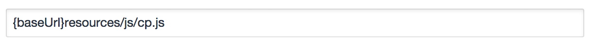
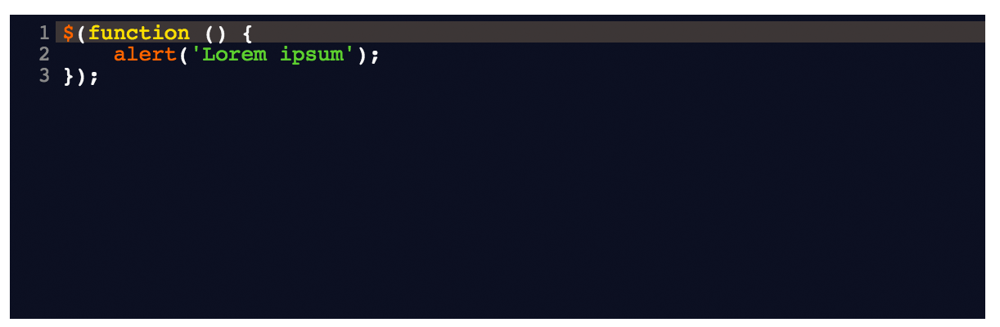

Control Panel JS plugin for Craft CMS
======================================

Easily insert additional JavaScript into the Craft Control Panel.

***

>This version is for Craft 2. To install it, download and move the `cpjs` folder into your `craft/plugins` directory.
>
>For the Craft 3 version, see the [`v2` branch...](https://github.com/doublesecretagency/craft-cpjs/tree/v2)

***

After you've installed the plugin, go to:

- **Settings > Plugins > Control Panel JS**

Your custom JavaScript can be saved in either (or both) of two places:

**1) An external file in your public directory...**

**2) The "Additional JavaScript" field on the settings page...**

You can customize your JavaScript in any way you see fit!
