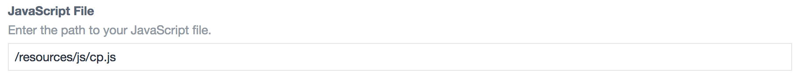
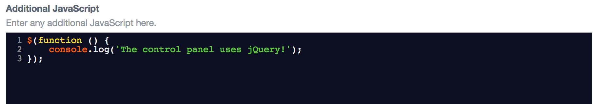

# Control Panel JS plugin for Craft CMS

**Add custom JS to your Control Panel.**

---

Easily insert additional JavaScript into the Craft Control Panel.

After installing the plugin, go to:

- **Settings > Control Panel JS**

Your custom JavaScript can be saved in either (or both) of two places:

**1) An external file in your public directory...**


**2) The "Additional JavaScript" field on the settings page...**


You can customize your JavaScript in any way you see fit!

---

## File Hashing

To ensure you get the freshest version of your JS, a cache-busting hash is appended to the end of each file reference.

This can be disabled by setting `cacheBusting` to **false** in the [PHP config file](https://github.com/doublesecretagency/craft-cpjs/blob/v2/src/config.php)...

```php
// Disable hash-based cache busting
'cacheBusting' => false
```

See config file for usage instructions.

---

## Anything else?

We've got other plugins too!

Check out the full catalog at [plugins.doublesecretagency.com](https://plugins.doublesecretagency.com)

**On behalf of Double Secret Agency, thanks for checking out our plugin!** 🍺

<p align="center">
    
</p>
